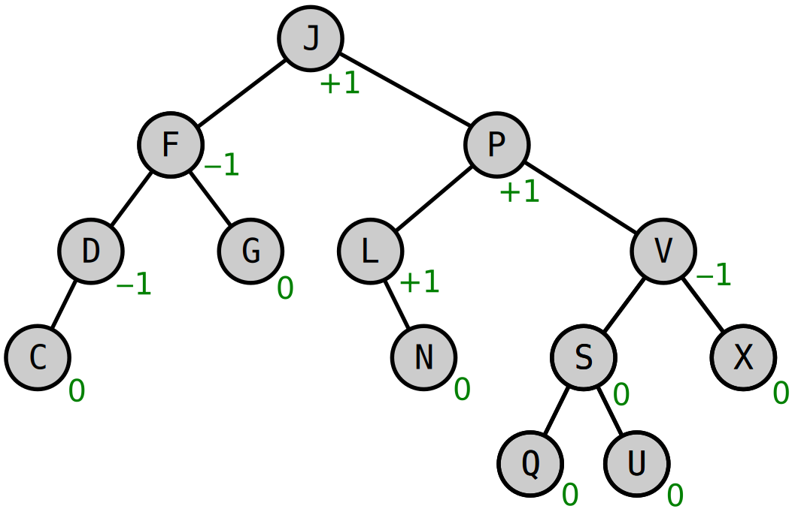

```@meta
DocTestSetup = :(using DataStructures)
```

# AVL Tree

The AVL Tree is a self-balancing binary search tree in which balancing operations take place
based on the difference of height between the left and right subtrees. Such operations may occur
during the insertion and deletion of keys performing recursive _rotate operations_ to ensue
that the difference between the heights of the left and right substrees is restricted to
$[-1, 1]$.



Example of AVL Tree with balance factors shown in green.

AVL Trees are often compared with [Red–Black Trees](./red_black_tree.md) because both take $O(\log n)$ time for the basic
operations. However, for lookup-intensive applications, AVL Trees are faster than Red–Black Trees
because they are more strictly balanced. Similar to Red–Black Trees, AVL Trees are height-balanced.

!!! note "Complexity"

    Computational complexity for common operations using an AVL Tree

    | Operation | Average Case | Worst Case |
    |-----------|--------------|------------|
    | Space | $\Theta(n)$ | $O(n)$ |
    | Search | $\Theta(\log n)$ | $O(\log n)$ |
    | Insertion | $\Theta(\log n)$ | $O(\log n)$ |
    | Deletion | $\Theta(\log n)$ | $O(\log n)$ |

# Constructors

```@autodocs
Modules = [DataStructures]
Pages = ["src/avl_tree.jl"]
Order = [:type]
```

# Usage

The `AVLTree` type implements the following methods:

- [`delete!(tree::AVLTree{K}, k::K) where K`](@ref)
- [`in(key, tree::AVLTree)`](@ref)
- [`getindex(tree::AVLTree{K}, ind::Integer) where K`](@ref)
- [`haskey(tree::AVLTree{K}, k::K) where K`](@ref)
- [`push!(tree::AVLTree{K}, k) where K`](@ref)
- [`sorted_rank(tree::AVLTree{K}, key::K) where K`](@ref)

-----

```@autodocs
Modules = [DataStructures]
Pages = ["src/avl_tree.jl"]
Order = [:function]
```

```@meta
DocTestSetup = nothing
```
